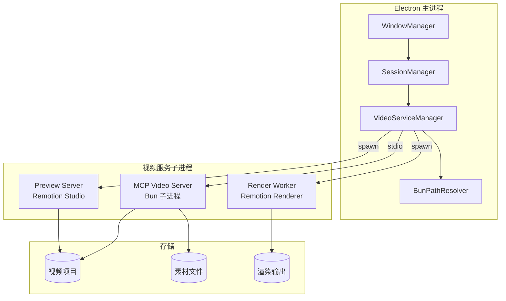
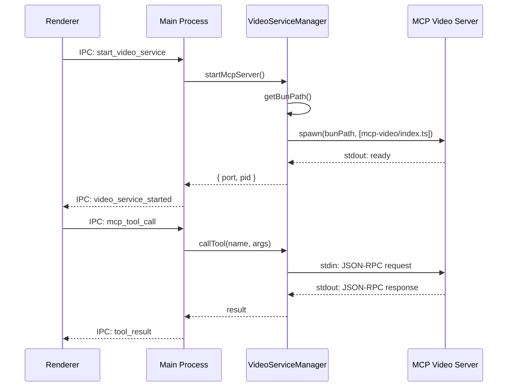
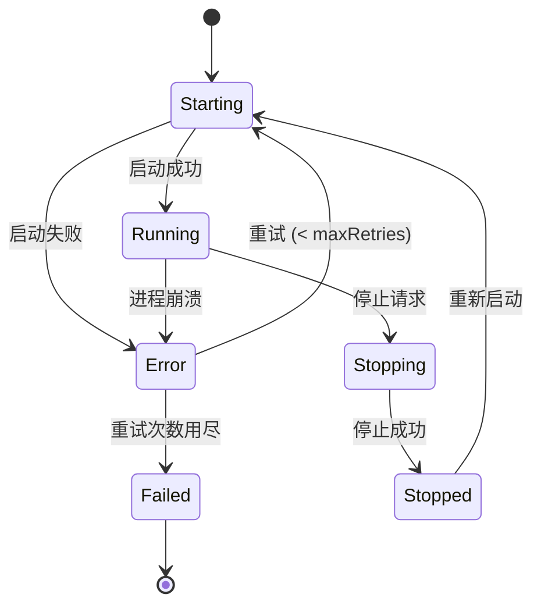

# 设计文档

## 概述

本设计文档描述了如何将 Sprouty AI 桌面应用的视频功能从依赖外部 `npx` 命令迁移到使用内置 Bun 运行时。核心思路是：

1. **提取 Bun 路径解析逻辑** - 从 `sessions.ts` 中提取 Bun 路径解析逻辑到独立模块
2. **创建视频服务管理器** - 统一管理 MCP Video Server、预览服务器等子进程
3. **重构预览服务器** - 使用 Bun 子进程替代 `npx remotion studio`
4. **重构渲染工作器** - 使用 Bun 子进程替代动态 import

## 架构

### 整体架构图



### 进程通信架构



## 组件和接口

### 1. BunPathResolver 模块

**文件位置**: `apps/electron/src/main/bun-path.ts`

```typescript
/**
 * Bun 路径解析器
 * 提供获取内置 Bun 可执行文件路径的统一接口
 */

export interface BunPathResolverOptions {
  /** 是否为打包模式（默认自动检测） */
  isPackaged?: boolean;
  /** 应用基础路径（默认自动检测） */
  basePath?: string;
  /** 资源路径（Windows 专用，默认 process.resourcesPath） */
  resourcesPath?: string;
}

export interface BunPathResolver {
  /**
   * 获取 Bun 可执行文件路径
   * @throws Error 如果 Bun 不存在
   */
  getBunPath(): string;
  
  /**
   * 检查 Bun 是否可用
   */
  isBunAvailable(): boolean;
  
  /**
   * 获取 Bun 版本
   */
  getBunVersion(): Promise<string>;
}

export function createBunPathResolver(options?: BunPathResolverOptions): BunPathResolver;
```

### 2. VideoServiceManager 模块

**文件位置**: `apps/electron/src/main/video/service-manager.ts`

```typescript
/**
 * 视频服务管理器
 * 管理 MCP Video Server 和其他视频相关子进程
 */

import type { ChildProcess } from 'child_process';

export interface VideoServiceConfig {
  /** MCP Video Server 入口文件路径 */
  mcpServerEntry: string;
  /** 最大重试次数 */
  maxRetries?: number;
  /** 重试间隔（毫秒） */
  retryInterval?: number;
  /** 启动超时（毫秒） */
  startupTimeout?: number;
}

export interface ServiceStatus {
  /** 服务是否运行中 */
  running: boolean;
  /** 进程 ID */
  pid?: number;
  /** 启动时间 */
  startedAt?: number;
  /** 重启次数 */
  restartCount: number;
  /** 最后错误 */
  lastError?: string;
}

export interface VideoServiceManager {
  /**
   * 启动 MCP Video Server
   */
  startMcpServer(): Promise<void>;
  
  /**
   * 停止 MCP Video Server
   */
  stopMcpServer(): Promise<void>;
  
  /**
   * 重启 MCP Video Server
   */
  restartMcpServer(): Promise<void>;
  
  /**
   * 获取服务状态
   */
  getStatus(): ServiceStatus;
  
  /**
   * 获取 MCP 服务器进程（用于 stdio 通信）
   */
  getMcpProcess(): ChildProcess | null;
  
  /**
   * 停止所有服务
   */
  stopAll(): Promise<void>;
}

export function createVideoServiceManager(
  bunResolver: BunPathResolver,
  config: VideoServiceConfig
): VideoServiceManager;
```

### 3. 重构后的 PreviewServer

**文件位置**: `apps/electron/src/main/video/preview-server.ts`

```typescript
/**
 * 预览服务器（使用 Bun 子进程）
 */

export interface PreviewServerConfig {
  /** 端口号 */
  port?: number;
  /** 主机地址 */
  host?: string;
  /** 启动超时（毫秒） */
  startupTimeout?: number;
}

export interface PreviewServerResult {
  /** 预览 URL */
  url: string;
  /** 端口号 */
  port: number;
  /** 进程 ID */
  pid: number;
}

export interface IPreviewServer {
  /**
   * 启动预览服务器
   * @param projectPath 项目路径
   * @param config 配置选项
   */
  start(projectPath: string, config?: PreviewServerConfig): Promise<PreviewServerResult>;
  
  /**
   * 停止预览服务器
   * @param projectPath 项目路径
   */
  stop(projectPath: string): Promise<void>;
  
  /**
   * 停止所有预览服务器
   */
  stopAll(): Promise<void>;
  
  /**
   * 检查预览服务器是否运行中
   */
  isRunning(projectPath: string): boolean;
  
  /**
   * 获取预览 URL
   */
  getUrl(projectPath: string): string | null;
}
```

### 4. 重构后的 RenderWorker

**文件位置**: `apps/electron/src/main/video/render-worker.ts`

```typescript
/**
 * 渲染工作器（使用 Bun 子进程）
 */

export interface RenderOptions {
  /** 项目路径 */
  projectPath: string;
  /** 组合 ID */
  compositionId: string;
  /** 输出路径 */
  outputPath: string;
  /** 质量预设 */
  quality: 'draft' | 'preview' | 'production' | 'high';
  /** 输出格式 */
  outputFormat?: 'mp4' | 'webm' | 'gif';
  /** 进度回调 */
  onProgress?: (progress: RenderProgress) => void;
}

export interface RenderProgress {
  /** 状态 */
  status: 'bundling' | 'preparing' | 'rendering' | 'completed' | 'failed';
  /** 进度百分比 (0-100) */
  progress: number;
  /** 错误信息 */
  error?: string;
}

export interface IRenderWorker {
  /**
   * 渲染视频
   * @returns 输出文件路径
   */
  render(options: RenderOptions): Promise<string>;
  
  /**
   * 取消渲染
   */
  cancel(): void;
}
```

## 数据模型

### 服务状态模型

```typescript
interface VideoServiceState {
  /** MCP 服务器状态 */
  mcpServer: {
    status: 'stopped' | 'starting' | 'running' | 'error';
    pid?: number;
    startedAt?: number;
    restartCount: number;
    lastError?: string;
  };
  
  /** 预览服务器状态（按项目路径索引） */
  previewServers: Map<string, {
    status: 'stopped' | 'starting' | 'running' | 'error';
    pid?: number;
    port?: number;
    url?: string;
  }>;
  
  /** 渲染任务状态（按任务 ID 索引） */
  renderTasks: Map<string, {
    status: RenderProgress['status'];
    progress: number;
    pid?: number;
    outputPath?: string;
    error?: string;
  }>;
}
```

### IPC 通道定义

```typescript
// 新增的 IPC 通道
const VIDEO_IPC_CHANNELS = {
  // 服务管理
  START_VIDEO_SERVICE: 'video:start-service',
  STOP_VIDEO_SERVICE: 'video:stop-service',
  GET_SERVICE_STATUS: 'video:get-status',
  SERVICE_STATUS_CHANGED: 'video:status-changed',
  
  // 预览
  START_PREVIEW: 'video:start-preview',
  STOP_PREVIEW: 'video:stop-preview',
  PREVIEW_STARTED: 'video:preview-started',
  PREVIEW_STOPPED: 'video:preview-stopped',
  
  // 渲染
  START_RENDER: 'video:start-render',
  CANCEL_RENDER: 'video:cancel-render',
  RENDER_PROGRESS: 'video:render-progress',
  RENDER_COMPLETED: 'video:render-completed',
  RENDER_FAILED: 'video:render-failed',
} as const;
```


## 正确性属性

*正确性属性是一种特征或行为，应该在系统的所有有效执行中保持为真——本质上是关于系统应该做什么的形式化陈述。属性作为人类可读规范和机器可验证正确性保证之间的桥梁。*

### Property 1: Bun 路径解析的完整性

*对于任意* 有效的配置选项（打包模式/开发模式、Windows/macOS/Linux），`getBunPath()` 方法要么返回一个存在的可执行文件路径，要么抛出包含描述性信息的错误。

**Validates: Requirements 1.1, 1.6**

### Property 2: 服务生命周期状态一致性

*对于任意* 生命周期操作序列（启动、停止、重启），Video_Service_Manager 的状态应该正确转换：
- 启动后状态为 'running'
- 停止后状态为 'stopped'
- 重启后状态为 'running'
- 进程意外退出后状态为 'error' 且支持重启

**Validates: Requirements 2.2, 2.5**

### Property 3: 预览服务器的多实例管理

*对于任意* 项目路径集合，Preview_Server 应该能够：
- 为每个项目启动独立的预览服务器
- 每个服务器使用不同的端口
- 停止特定项目的服务器不影响其他服务器
- 停止所有服务器后，所有资源被正确清理

**Validates: Requirements 3.3, 3.4, 3.5, 3.6**

### Property 4: 渲染进度报告的顺序性

*对于任意* 渲染任务，进度回调应该按以下顺序报告状态：
1. 'bundling' (0-30%)
2. 'preparing' (30-40%)
3. 'rendering' (40-100%)
4. 'completed' 或 'failed'

且进度值应该单调递增（除非发生错误）。

**Validates: Requirements 4.3, 4.4, 4.5**

### Property 5: 渲染输出格式的正确性

*对于任意* 有效的输出格式（mp4、webm、gif）和质量预设（draft、preview、production、high），渲染输出文件应该：
- 具有正确的文件扩展名
- 文件大小大于 0
- 可以被标准播放器打开

**Validates: Requirements 4.6**

### Property 6: 进程通信的可靠性

*对于任意* 子进程输出（stdout/stderr），Video_Service_Manager 应该：
- 将 stdout 转发到主进程日志系统
- 将 stderr 捕获并记录为错误
- 支持向子进程发送 SIGTERM 和 SIGKILL 信号
- 在 SIGTERM 超时后自动发送 SIGKILL

**Validates: Requirements 6.2, 6.3, 6.4, 6.5**

### Property 7: 错误恢复的幂等性

*对于任意* 错误场景（启动失败、超时、进程崩溃），重试操作应该：
- 不超过配置的最大重试次数
- 每次重试保持相同的配置状态
- 最终要么成功恢复，要么返回明确的失败状态

**Validates: Requirements 7.1, 7.2, 7.4, 7.5**

## 错误处理

### 错误分类

```typescript
enum VideoServiceError {
  // Bun 相关错误
  BUN_NOT_FOUND = 'BUN_NOT_FOUND',
  BUN_EXECUTION_FAILED = 'BUN_EXECUTION_FAILED',
  
  // MCP 服务器错误
  MCP_SERVER_START_FAILED = 'MCP_SERVER_START_FAILED',
  MCP_SERVER_CRASHED = 'MCP_SERVER_CRASHED',
  MCP_SERVER_TIMEOUT = 'MCP_SERVER_TIMEOUT',
  
  // 预览服务器错误
  PREVIEW_START_FAILED = 'PREVIEW_START_FAILED',
  PREVIEW_PORT_IN_USE = 'PREVIEW_PORT_IN_USE',
  PREVIEW_TIMEOUT = 'PREVIEW_TIMEOUT',
  
  // 渲染错误
  RENDER_BUNDLE_FAILED = 'RENDER_BUNDLE_FAILED',
  RENDER_COMPOSITION_NOT_FOUND = 'RENDER_COMPOSITION_NOT_FOUND',
  RENDER_FAILED = 'RENDER_FAILED',
  RENDER_OUTPUT_WRITE_FAILED = 'RENDER_OUTPUT_WRITE_FAILED',
  RENDER_CANCELLED = 'RENDER_CANCELLED',
  
  // 通用错误
  INVALID_PROJECT_PATH = 'INVALID_PROJECT_PATH',
  PROCESS_COMMUNICATION_FAILED = 'PROCESS_COMMUNICATION_FAILED',
}
```

### 错误处理策略

1. **Bun 不存在**: 抛出错误，阻止服务启动，提示用户检查应用安装
2. **MCP 服务器启动失败**: 记录错误，支持手动重试，最多重试 3 次
3. **预览服务器端口占用**: 自动尝试下一个可用端口
4. **渲染失败**: 返回分类的错误信息，支持用户重试
5. **进程通信失败**: 记录错误，尝试重启服务

### 错误恢复流程



## 测试策略

### 单元测试

1. **BunPathResolver 测试**
   - 测试打包模式下的路径解析
   - 测试开发模式下的路径解析
   - 测试不同平台的路径格式
   - 测试 Bun 不存在时的错误处理

2. **VideoServiceManager 测试**
   - 测试服务启动/停止/重启
   - 测试状态转换
   - 测试错误恢复
   - 测试配置持久化

3. **PreviewServer 测试**
   - 测试单个预览服务器启动
   - 测试多个预览服务器并发
   - 测试端口冲突处理
   - 测试资源清理

4. **RenderWorker 测试**
   - 测试渲染进度报告
   - 测试取消渲染
   - 测试不同输出格式
   - 测试错误分类

### 属性测试

属性测试应使用 `fast-check` 库，每个属性测试至少运行 100 次迭代。

1. **Property 1 测试**: 生成随机配置选项，验证 getBunPath() 的行为
2. **Property 2 测试**: 生成随机操作序列，验证状态转换正确性
3. **Property 3 测试**: 生成随机项目路径集合，验证多实例管理
4. **Property 4 测试**: 模拟渲染过程，验证进度报告顺序
5. **Property 6 测试**: 模拟子进程输出，验证通信可靠性
6. **Property 7 测试**: 模拟错误场景，验证恢复幂等性

### 集成测试

1. **端到端流程测试**
   - 启动 MCP Video Server
   - 调用项目管理工具
   - 启动预览服务器
   - 执行渲染任务
   - 停止所有服务

2. **IPC 通信测试**
   - 测试 Renderer -> Main -> VideoService 的完整通信链路
   - 测试事件广播
   - 测试错误传播

## 实现注意事项

### 1. Bun 路径解析的提取

从 `sessions.ts` 中提取 Bun 路径解析逻辑时，需要注意：
- 保持与现有逻辑的兼容性
- 支持依赖注入以便测试
- 处理 Windows 的 extraResources 特殊情况

### 2. 子进程管理

使用 Node.js 的 `child_process.spawn` 时：
- 使用 `stdio: ['pipe', 'pipe', 'pipe']` 以支持双向通信
- 设置 `detached: false` 确保子进程随主进程退出
- 在 Windows 上使用 `taskkill` 命令终止进程树

### 3. MCP Video Server 集成

MCP Video Server 已经支持 stdio 传输模式，集成时：
- 直接使用 `bun run apps/mcp-video/src/index.ts` 启动
- 通过 stdin/stdout 进行 JSON-RPC 通信
- 监听 stderr 获取错误日志

### 4. Remotion 依赖处理

Remotion 相关依赖（@remotion/bundler、@remotion/renderer）需要：
- 在 MCP Video Server 中处理，而非 Electron 主进程
- 通过 Bun 子进程调用，避免 Electron 主进程的模块加载问题
- 考虑将渲染脚本独立为单独的入口文件
