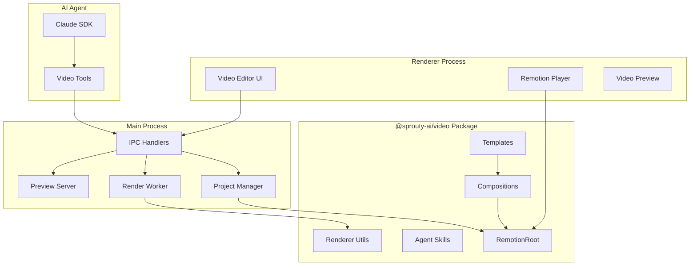
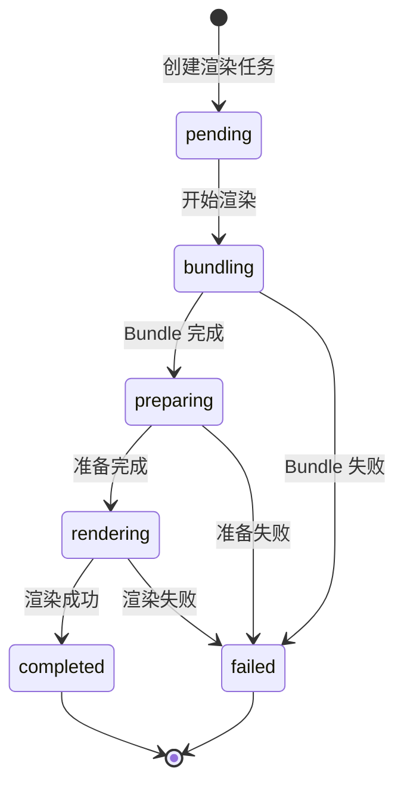

# Design Document: Remotion Video Integration

## Overview

本设计文档描述了将 Remotion 视频创作引擎集成到 Sprouty AI 桌面应用的技术架构和实现方案。

### 核心目标

1. **创建独立的视频处理包** - `@sprouty-ai/video`，封装 Remotion 相关逻辑
2. **实现完整的视频编辑器 UI** - 提供直观的视频创作界面
3. **集成 AI Agent 能力** - 支持通过自然语言创建和编辑视频
4. **提供本地渲染能力** - 支持多种格式和质量的视频导出

### 技术栈

- **Remotion ^4.0.0** - 程序化视频创作框架
- **React 18** - UI 框架
- **TypeScript** - 类型安全
- **Zod** - 数据验证
- **Electron IPC** - 主进程/渲染进程通信

## Architecture

### 整体架构图



### 目录结构

```
Sprouty AI/
├── packages/
│   └── video/                          # @sprouty-ai/video
│       ├── package.json
│       ├── tsconfig.json
│       ├── remotion.config.ts
│       └── src/
│           ├── index.ts                # 导出入口
│           ├── Root.tsx                # Remotion 根组件
│           ├── types.ts                # 类型定义
│           ├── compositions/           # 视频组件
│           │   ├── index.ts
│           │   ├── TitleAnimation.tsx
│           │   ├── Slideshow.tsx
│           │   ├── DataVisualization.tsx
│           │   └── ProductShowcase.tsx
│           ├── templates/              # 预设模板
│           │   ├── index.ts
│           │   ├── social-media.ts
│           │   ├── marketing.ts
│           │   └── tutorial.ts
│           ├── components/             # 可复用组件
│           │   ├── index.ts
│           │   ├── AnimatedText.tsx
│           │   ├── Transition.tsx
│           │   ├── Background.tsx
│           │   └── Logo.tsx
│           ├── hooks/                  # Remotion hooks
│           │   ├── index.ts
│           │   ├── useAnimation.ts
│           │   └── useAssets.ts
│           ├── renderer/               # 渲染器
│           │   ├── index.ts
│           │   ├── local-renderer.ts
│           │   └── preview-server.ts
│           ├── skills/                 # AI Agent Skills
│           │   ├── index.ts
│           │   ├── video-tools.ts
│           │   └── AGENTS.md
│           └── utils/
│               ├── index.ts
│               ├── interpolation.ts
│               └── color.ts
│
├── apps/electron/
│   └── src/
│       ├── main/
│       │   └── video/                  # 主进程视频服务
│       │       ├── index.ts
│       │       ├── ipc-handlers.ts
│       │       ├── project-manager.ts
│       │       └── render-worker.ts
│       │
│       ├── preload/
│       │   └── video-api.ts
│       │
│       └── renderer/
│           └── components/video/       # 视频编辑器 UI
│               ├── index.ts
│               ├── VideoEditor.tsx
│               ├── VideoPreview.tsx
│               ├── VideoTimeline.tsx
│               ├── VideoProperties.tsx
│               ├── VideoProjectList.tsx
│               ├── VideoTemplates.tsx
│               └── VideoExport.tsx
```

## Components and Interfaces

### 1. Video Package 核心接口

#### 1.1 VideoProject 数据模型

```typescript
// packages/video/src/types.ts
import { z } from 'zod';

export const VideoConfigSchema = z.object({
  width: z.number().default(1920),
  height: z.number().default(1080),
  fps: z.number().default(30),
  durationInFrames: z.number(),
});

export const CompositionSchema = z.object({
  id: z.string(),
  name: z.string(),
  code: z.string(),
  props: z.record(z.any()).default({}),
});

export const AssetSchema = z.object({
  id: z.string(),
  type: z.enum(['image', 'video', 'audio', 'font']),
  name: z.string(),
  path: z.string(),
});

export const RenderHistorySchema = z.object({
  id: z.string(),
  compositionId: z.string(),
  outputPath: z.string(),
  status: z.enum(['pending', 'rendering', 'completed', 'failed']),
  progress: z.number().min(0).max(100),
  createdAt: z.string(),
  error: z.string().optional(),
});

export const VideoProjectSchema = z.object({
  id: z.string(),
  name: z.string(),
  description: z.string().optional(),
  createdAt: z.string(),
  updatedAt: z.string(),
  config: VideoConfigSchema,
  compositions: z.array(CompositionSchema),
  assets: z.array(AssetSchema),
  renders: z.array(RenderHistorySchema),
});

export type VideoConfig = z.infer<typeof VideoConfigSchema>;
export type Composition = z.infer<typeof CompositionSchema>;
export type Asset = z.infer<typeof AssetSchema>;
export type RenderHistory = z.infer<typeof RenderHistorySchema>;
export type VideoProject = z.infer<typeof VideoProjectSchema>;
```

#### 1.2 模板接口

```typescript
// packages/video/src/templates/types.ts
export interface TemplateProps {
  title?: string;
  subtitle?: string;
  items?: Array<{
    title: string;
    description?: string;
    image?: string;
  }>;
  colors?: {
    primary: string;
    secondary: string;
    background: string;
    text: string;
  };
  logo?: string;
  cta?: {
    text: string;
    url?: string;
  };
}

export interface VideoTemplate {
  id: string;
  name: string;
  description: string;
  category: 'social-media' | 'marketing' | 'tutorial';
  defaultConfig: {
    width: number;
    height: number;
    fps: number;
    durationInFrames: number;
  };
  defaultProps: TemplateProps;
  compositionCode: string;
}
```

### 2. Electron 主进程接口

#### 2.1 IPC 通道定义

```typescript
// apps/electron/src/shared/video-types.ts
export const VIDEO_IPC_CHANNELS = {
  // 项目管理
  CREATE_PROJECT: 'video:create-project',
  LIST_PROJECTS: 'video:list-projects',
  GET_PROJECT: 'video:get-project',
  UPDATE_PROJECT: 'video:update-project',
  DELETE_PROJECT: 'video:delete-project',
  
  // 素材管理
  ADD_ASSET: 'video:add-asset',
  REMOVE_ASSET: 'video:remove-asset',
  
  // 渲染
  RENDER: 'video:render',
  CANCEL_RENDER: 'video:cancel-render',
  RENDER_PROGRESS: 'video:render-progress',
  
  // 预览
  START_PREVIEW: 'video:start-preview',
  STOP_PREVIEW: 'video:stop-preview',
} as const;

export interface CreateProjectOptions {
  name: string;
  workspaceId: string;
  template?: string;
  config?: Partial<VideoConfig>;
}

export interface RenderOptions {
  projectId: string;
  compositionId: string;
  outputFormat: 'mp4' | 'webm' | 'gif';
  quality: 'draft' | 'standard' | 'high';
}

export interface RenderProgress {
  status: 'bundling' | 'preparing' | 'rendering' | 'completed' | 'failed';
  progress: number;
  error?: string;
}
```

#### 2.2 Project Manager 接口

```typescript
// apps/electron/src/main/video/project-manager.ts
export interface IProjectManager {
  createProject(options: CreateProjectOptions): Promise<VideoProject>;
  listProjects(workspaceId: string): Promise<VideoProject[]>;
  getProject(projectId: string): Promise<VideoProject | null>;
  updateProject(projectId: string, updates: Partial<VideoProject>): Promise<VideoProject>;
  deleteProject(projectId: string): Promise<boolean>;
  addAsset(projectId: string, assetPath: string, assetType: Asset['type']): Promise<Asset>;
  removeAsset(projectId: string, assetId: string): Promise<boolean>;
  getProjectPath(projectId: string): string;
}
```

#### 2.3 Render Worker 接口

```typescript
// apps/electron/src/main/video/render-worker.ts
export interface IRenderWorker {
  render(options: RenderWorkerOptions): Promise<string>;
  cancel(): void;
}

export interface RenderWorkerOptions {
  projectPath: string;
  compositionId: string;
  outputPath: string;
  quality: 'draft' | 'standard' | 'high';
  onProgress?: (progress: RenderProgress) => void;
}

export const QUALITY_PRESETS = {
  draft: { crf: 28, scale: 0.5, fps: 15 },
  standard: { crf: 18, scale: 1, fps: 30 },
  high: { crf: 12, scale: 1, fps: 60 },
} as const;
```

### 3. 渲染进程接口

#### 3.1 Video API (Preload)

```typescript
// apps/electron/src/preload/video-api.ts
export interface VideoAPI {
  // 项目管理
  createProject(options: CreateProjectOptions): Promise<VideoProject>;
  listProjects(workspaceId: string): Promise<VideoProject[]>;
  getProject(projectId: string): Promise<VideoProject | null>;
  updateProject(projectId: string, updates: Partial<VideoProject>): Promise<VideoProject>;
  deleteProject(projectId: string): Promise<boolean>;
  
  // 素材管理
  addAsset(projectId: string, assetPath: string, assetType: Asset['type']): Promise<Asset>;
  removeAsset(projectId: string, assetId: string): Promise<boolean>;
  
  // 渲染
  render(options: RenderOptions): Promise<string | null>;
  cancelRender(): void;
  onRenderProgress(callback: (progress: RenderProgress) => void): () => void;
  
  // 预览
  startPreview(projectId: string): Promise<{ url: string }>;
  stopPreview(projectId: string): Promise<void>;
}
```

#### 3.2 VideoEditor 组件 Props

```typescript
// apps/electron/src/renderer/components/video/types.ts
export interface VideoEditorProps {
  workspaceId: string;
}

export interface VideoPreviewProps {
  project: VideoProject | null;
  playerRef: React.RefObject<PlayerRef>;
  onFrameChange: (frame: number) => void;
}

export interface VideoTimelineProps {
  project: VideoProject | null;
  currentFrame: number;
  onFrameChange: (frame: number) => void;
  isPlaying: boolean;
  onPlayPause: () => void;
}

export interface VideoPropertiesProps {
  project: VideoProject | null;
  onUpdate: (updates: Partial<VideoProject>) => void;
  onRender: () => void;
}

export interface VideoProjectListProps {
  workspaceId: string;
  onSelect: (project: VideoProject) => void;
  selected?: string;
}

export interface VideoTemplatesProps {
  onSelect: (template: VideoTemplate) => void;
}

export interface VideoExportProps {
  project: VideoProject;
  onExport: (options: RenderOptions) => void;
  onCancel: () => void;
}
```

### 4. AI Agent Skills 接口

```typescript
// packages/video/src/skills/video-tools.ts
export interface VideoCreateProjectInput {
  name: string;
  template?: 'blank' | 'title-animation' | 'slideshow' | 'product-showcase' | 'social-media';
  width?: number;
  height?: number;
  fps?: number;
  durationInSeconds: number;
}

export interface VideoGenerateCompositionInput {
  projectId: string;
  description: string;
  style?: 'modern' | 'minimal' | 'playful' | 'corporate' | 'cinematic';
  colorScheme?: {
    primary: string;
    secondary: string;
    background: string;
  };
}

export interface VideoUpdateCompositionInput {
  projectId: string;
  compositionId: string;
  changes: string;
}

export interface VideoPreviewInput {
  projectId: string;
  compositionId?: string;
  startFrame?: number;
}

export interface VideoRenderInput {
  projectId: string;
  compositionId: string;
  outputFormat?: 'mp4' | 'webm' | 'gif';
  quality?: 'draft' | 'standard' | 'high';
}

export interface VideoAddAssetInput {
  projectId: string;
  assetPath: string;
  assetType: 'image' | 'video' | 'audio' | 'font';
}
```

## Data Models

### 1. 视频项目存储结构

```
~/.creator-flow/workspaces/{workspaceId}/
└── .creator-flow/
    └── video-projects/
        └── {projectId}/
            ├── project.json          # 项目元数据
            ├── compositions/         # 组件代码
            │   └── {compositionId}.tsx
            └── assets/               # 素材文件
                ├── images/
                ├── videos/
                ├── audio/
                └── fonts/
```

### 2. project.json 结构

```json
{
  "id": "proj_abc123",
  "name": "产品介绍视频",
  "description": "智能创作助手产品介绍",
  "createdAt": "2024-01-15T10:00:00Z",
  "updatedAt": "2024-01-15T12:30:00Z",
  "config": {
    "width": 1920,
    "height": 1080,
    "fps": 30,
    "durationInFrames": 300
  },
  "compositions": [
    {
      "id": "comp_001",
      "name": "MainVideo",
      "code": "compositions/comp_001.tsx",
      "props": {
        "title": "智能创作助手",
        "subtitle": "AI 驱动的内容创作平台"
      }
    }
  ],
  "assets": [
    {
      "id": "asset_001",
      "type": "image",
      "name": "logo.png",
      "path": "assets/images/logo.png"
    }
  ],
  "renders": [
    {
      "id": "render_001",
      "compositionId": "comp_001",
      "outputPath": "/Users/user/Videos/output.mp4",
      "status": "completed",
      "progress": 100,
      "createdAt": "2024-01-15T12:00:00Z"
    }
  ]
}
```

### 3. 渲染进度状态机




## Correctness Properties

*A property is a characteristic or behavior that should hold true across all valid executions of a system—essentially, a formal statement about what the system should do. Properties serve as the bridge between human-readable specifications and machine-verifiable correctness guarantees.*

### Property 1: VideoProject Schema Validation

*For any* valid VideoProject object, the Zod schema validation SHALL pass, and the object SHALL contain all required fields (id, name, createdAt, updatedAt, config with width/height/fps/durationInFrames).

*For any* object missing required fields, the Zod schema validation SHALL fail with appropriate error messages.

**Validates: Requirements 2.1, 2.2, 2.3, 2.4, 2.5**

### Property 2: Project Persistence Round-Trip

*For any* valid VideoProject, saving it to disk and then loading it back SHALL produce an equivalent VideoProject object.

This includes:
- Project metadata (id, name, description, timestamps)
- Config settings (width, height, fps, durationInFrames)
- Compositions array with code references
- Assets array with file paths
- Render history

**Validates: Requirements 12.1, 12.2, 12.3, 12.4**

### Property 3: IPC Channel Completeness

*For any* video operation (create, list, get, update, delete project; add/remove asset; render; preview), there SHALL exist a corresponding IPC handler that responds correctly.

*For any* IPC call with valid parameters, the handler SHALL return a valid response or throw a descriptive error.

**Validates: Requirements 8.2, 8.3, 8.4, 8.6**

### Property 4: Agent Skills Tool Completeness

*For any* video creation workflow step (create project, generate composition, update composition, preview, render, add asset), there SHALL exist a corresponding Agent Skill tool.

*For any* tool invocation with valid input, the tool SHALL return a valid result or a descriptive error.

**Validates: Requirements 10.1, 10.2, 10.3, 10.4, 10.5, 10.6**

### Property 5: Render Progress Reporting

*For any* render operation, the Render_Worker SHALL emit progress events with status and progress percentage (0-100).

*For any* progress event, the status SHALL be one of: 'bundling', 'preparing', 'rendering', 'completed', 'failed'.

*For any* successful render, the final progress event SHALL have status 'completed' and progress 100.

**Validates: Requirements 6.5**

### Property 6: Render Error Handling

*For any* render operation that fails, the Render_Worker SHALL return an error object containing:
- Error type/code
- Human-readable error message
- Stack trace or additional context (when available)

**Validates: Requirements 6.6**

### Property 7: Template Return Value Validation

*For any* template selection, the returned object SHALL contain:
- Valid Composition code (syntactically correct TypeScript/React)
- Default props matching the TemplateProps interface
- Default config with valid width, height, fps, durationInFrames

**Validates: Requirements 5.4, 5.5**

### Property 8: Corrupted Project Handling

*For any* corrupted or invalid project.json file in the video-projects directory, the Video_Service SHALL:
- Log an error with the project path and error details
- Skip the corrupted project without crashing
- Continue loading other valid projects

**Validates: Requirements 12.5**

### Property 9: Invalid Asset Error Handling

*For any* attempt to add an asset with:
- Non-existent file path
- Unsupported file format
- Invalid asset type

The Video_Service SHALL return a descriptive error message indicating the specific problem.

**Validates: Requirements 13.3**

### Property 10: Preload API Completeness

*For any* IPC channel defined in VIDEO_IPC_CHANNELS, there SHALL exist a corresponding method in the VideoAPI interface exposed through preload.

*For any* VideoAPI method, the TypeScript types SHALL match the expected IPC request/response types.

**Validates: Requirements 15.3**

## Error Handling

### 1. 渲染错误处理

```typescript
// 渲染错误类型
export enum RenderErrorType {
  BUNDLE_FAILED = 'BUNDLE_FAILED',
  COMPOSITION_NOT_FOUND = 'COMPOSITION_NOT_FOUND',
  RENDER_FAILED = 'RENDER_FAILED',
  OUTPUT_WRITE_FAILED = 'OUTPUT_WRITE_FAILED',
  CANCELLED = 'CANCELLED',
}

export interface RenderError {
  type: RenderErrorType;
  message: string;
  details?: string;
  stack?: string;
}

// 错误处理流程
async function handleRenderError(error: unknown): Promise<RenderError> {
  if (error instanceof Error) {
    // 分析错误类型
    if (error.message.includes('bundle')) {
      return {
        type: RenderErrorType.BUNDLE_FAILED,
        message: '视频项目打包失败',
        details: error.message,
        stack: error.stack,
      };
    }
    // ... 其他错误类型
  }
  return {
    type: RenderErrorType.RENDER_FAILED,
    message: '渲染过程中发生未知错误',
    details: String(error),
  };
}
```

### 2. 项目加载错误处理

```typescript
async function loadProjects(workspaceId: string): Promise<VideoProject[]> {
  const projectsDir = getProjectsDir(workspaceId);
  const projects: VideoProject[] = [];
  
  const entries = await readdir(projectsDir, { withFileTypes: true });
  
  for (const entry of entries) {
    if (!entry.isDirectory()) continue;
    
    try {
      const projectPath = join(projectsDir, entry.name, 'project.json');
      const data = await readFile(projectPath, 'utf-8');
      const parsed = JSON.parse(data);
      const validated = VideoProjectSchema.parse(parsed);
      projects.push(validated);
    } catch (error) {
      // 记录错误但继续加载其他项目
      logger.error(`Failed to load project ${entry.name}:`, error);
    }
  }
  
  return projects;
}
```

### 3. 素材验证错误处理

```typescript
const SUPPORTED_ASSET_TYPES = {
  image: ['.png', '.jpg', '.jpeg', '.gif', '.webp', '.svg'],
  video: ['.mp4', '.webm', '.mov'],
  audio: ['.mp3', '.wav', '.ogg', '.m4a'],
  font: ['.ttf', '.otf', '.woff', '.woff2'],
} as const;

async function validateAsset(
  assetPath: string,
  assetType: Asset['type']
): Promise<void> {
  // 检查文件是否存在
  if (!existsSync(assetPath)) {
    throw new Error(`素材文件不存在: ${assetPath}`);
  }
  
  // 检查文件扩展名
  const ext = extname(assetPath).toLowerCase();
  const supportedExts = SUPPORTED_ASSET_TYPES[assetType];
  
  if (!supportedExts.includes(ext as any)) {
    throw new Error(
      `不支持的${assetType}格式: ${ext}。支持的格式: ${supportedExts.join(', ')}`
    );
  }
}
```

## Testing Strategy

### 1. 测试方法概述

本项目采用双重测试策略：

- **单元测试**: 验证具体示例、边界情况和错误条件
- **属性测试**: 验证跨所有输入的通用属性

两种测试方法互补，共同提供全面的测试覆盖。

### 2. 属性测试配置

- **测试框架**: 使用 `fast-check` 作为属性测试库
- **最小迭代次数**: 每个属性测试至少运行 100 次
- **标签格式**: `Feature: remotion-video-integration, Property {number}: {property_text}`

### 3. 测试文件结构

```
Sprouty AI/packages/video/
└── src/
    └── __tests__/
        ├── types.test.ts           # Schema 验证测试
        ├── types.property.test.ts  # Schema 属性测试
        ├── templates.test.ts       # 模板单元测试
        └── templates.property.test.ts # 模板属性测试

Sprouty AI/apps/electron/
└── src/
    └── main/
        └── video/
            └── __tests__/
                ├── project-manager.test.ts      # 项目管理单元测试
                ├── project-manager.property.test.ts # 项目持久化属性测试
                ├── render-worker.test.ts        # 渲染器单元测试
                └── ipc-handlers.test.ts         # IPC 处理器测试
```

### 4. 属性测试示例

```typescript
// packages/video/src/__tests__/types.property.test.ts
import { fc } from 'fast-check';
import { VideoProjectSchema, VideoConfigSchema } from '../types';

describe('Feature: remotion-video-integration, Property 1: VideoProject Schema Validation', () => {
  // 生成有效的 VideoConfig
  const validConfigArb = fc.record({
    width: fc.integer({ min: 1, max: 7680 }),
    height: fc.integer({ min: 1, max: 4320 }),
    fps: fc.integer({ min: 1, max: 120 }),
    durationInFrames: fc.integer({ min: 1, max: 100000 }),
  });

  // 生成有效的 VideoProject
  const validProjectArb = fc.record({
    id: fc.uuid(),
    name: fc.string({ minLength: 1, maxLength: 100 }),
    description: fc.option(fc.string()),
    createdAt: fc.date().map(d => d.toISOString()),
    updatedAt: fc.date().map(d => d.toISOString()),
    config: validConfigArb,
    compositions: fc.array(fc.record({
      id: fc.uuid(),
      name: fc.string({ minLength: 1 }),
      code: fc.string(),
      props: fc.dictionary(fc.string(), fc.jsonValue()),
    })),
    assets: fc.array(fc.record({
      id: fc.uuid(),
      type: fc.constantFrom('image', 'video', 'audio', 'font'),
      name: fc.string({ minLength: 1 }),
      path: fc.string({ minLength: 1 }),
    })),
    renders: fc.array(fc.record({
      id: fc.uuid(),
      compositionId: fc.uuid(),
      outputPath: fc.string({ minLength: 1 }),
      status: fc.constantFrom('pending', 'rendering', 'completed', 'failed'),
      progress: fc.integer({ min: 0, max: 100 }),
      createdAt: fc.date().map(d => d.toISOString()),
    })),
  });

  it('should validate all valid VideoProject objects', () => {
    fc.assert(
      fc.property(validProjectArb, (project) => {
        const result = VideoProjectSchema.safeParse(project);
        expect(result.success).toBe(true);
      }),
      { numRuns: 100 }
    );
  });

  it('should reject projects missing required fields', () => {
    const invalidProjectArb = fc.record({
      // 缺少 id 字段
      name: fc.string({ minLength: 1 }),
      config: validConfigArb,
    });

    fc.assert(
      fc.property(invalidProjectArb, (project) => {
        const result = VideoProjectSchema.safeParse(project);
        expect(result.success).toBe(false);
      }),
      { numRuns: 100 }
    );
  });
});
```

```typescript
// apps/electron/src/main/video/__tests__/project-manager.property.test.ts
import { fc } from 'fast-check';
import { ProjectManager } from '../project-manager';
import { VideoProjectSchema } from '@sprouty-ai/video';

describe('Feature: remotion-video-integration, Property 2: Project Persistence Round-Trip', () => {
  let projectManager: ProjectManager;
  
  beforeEach(() => {
    projectManager = new ProjectManager(testWorkspacePath);
  });

  it('should preserve project data through save/load cycle', async () => {
    await fc.assert(
      fc.asyncProperty(validProjectArb, async (originalProject) => {
        // 保存项目
        await projectManager.saveProject(originalProject);
        
        // 加载项目
        const loadedProject = await projectManager.getProject(originalProject.id);
        
        // 验证数据一致性
        expect(loadedProject).toEqual(originalProject);
      }),
      { numRuns: 100 }
    );
  });
});
```

### 5. 单元测试示例

```typescript
// packages/video/src/__tests__/templates.test.ts
import { getTemplate, TEMPLATES } from '../templates';

describe('Video Templates', () => {
  describe('getTemplate', () => {
    it('should return social-media template with correct defaults', () => {
      const template = getTemplate('social-media');
      
      expect(template).toBeDefined();
      expect(template.id).toBe('social-media');
      expect(template.defaultConfig.width).toBe(1080);
      expect(template.defaultConfig.height).toBe(1920);
    });

    it('should return marketing template with 16:9 aspect ratio', () => {
      const template = getTemplate('marketing');
      
      expect(template.defaultConfig.width).toBe(1920);
      expect(template.defaultConfig.height).toBe(1080);
    });

    it('should throw error for unknown template', () => {
      expect(() => getTemplate('unknown')).toThrow('Template not found');
    });
  });
});
```

### 6. 集成测试

```typescript
// apps/electron/src/main/video/__tests__/ipc-handlers.test.ts
import { ipcMain } from 'electron';
import { registerVideoIpcHandlers } from '../ipc-handlers';

describe('Video IPC Handlers', () => {
  it('should register all required IPC channels', () => {
    const handlers = new Map();
    jest.spyOn(ipcMain, 'handle').mockImplementation((channel, handler) => {
      handlers.set(channel, handler);
    });

    registerVideoIpcHandlers(mockProjectManager, mockRenderWorker);

    expect(handlers.has('video:create-project')).toBe(true);
    expect(handlers.has('video:list-projects')).toBe(true);
    expect(handlers.has('video:get-project')).toBe(true);
    expect(handlers.has('video:update-project')).toBe(true);
    expect(handlers.has('video:delete-project')).toBe(true);
    expect(handlers.has('video:add-asset')).toBe(true);
    expect(handlers.has('video:remove-asset')).toBe(true);
    expect(handlers.has('video:render')).toBe(true);
    expect(handlers.has('video:start-preview')).toBe(true);
    expect(handlers.has('video:stop-preview')).toBe(true);
  });
});
```

### 7. 测试覆盖目标

| 模块 | 单元测试 | 属性测试 | 集成测试 |
|------|----------|----------|----------|
| types.ts | ✓ | ✓ | - |
| templates/ | ✓ | ✓ | - |
| compositions/ | ✓ | - | - |
| project-manager.ts | ✓ | ✓ | ✓ |
| render-worker.ts | ✓ | ✓ | ✓ |
| ipc-handlers.ts | ✓ | ✓ | ✓ |
| video-tools.ts | ✓ | ✓ | - |
| preload/video-api.ts | ✓ | ✓ | - |
